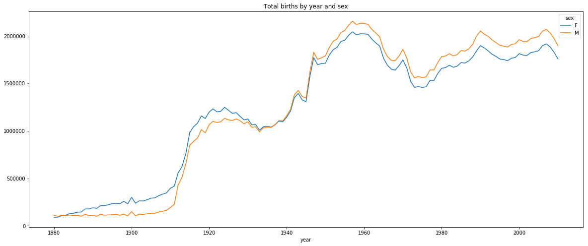
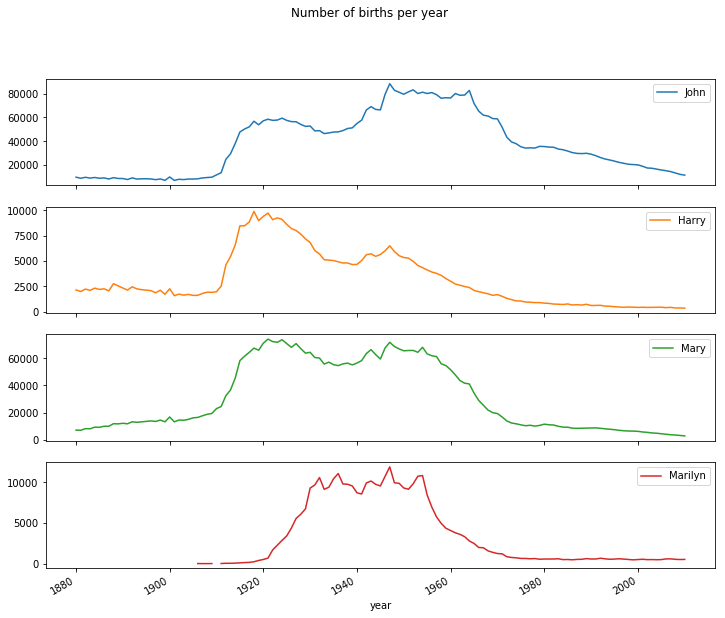
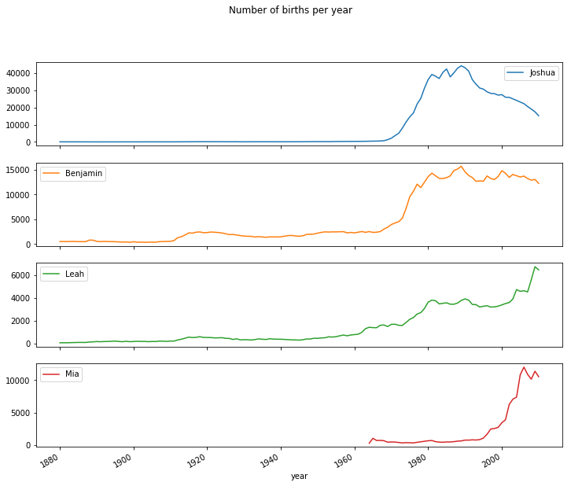
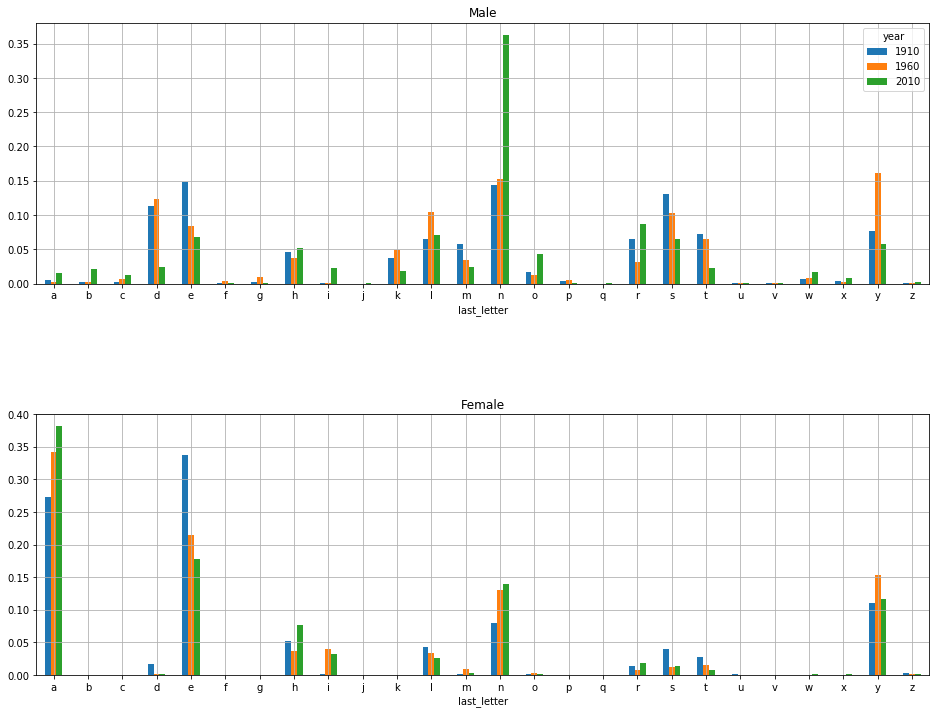

```python
import pandas as pd
```


```python
path = '/Users/hunghoang/Documents/Programming/myPython /Python-for-Data-Analysis/pydata-book-2nd-edition/datasets/babynames/'

pieces = []
columns = ['name', 'sex', 'births']
years = range(1880,2011)
for year in years:
    complete_path = path+'yob%d.txt' % year
    frame = pd.read_csv(complete_path, names=columns)

    frame['year'] = year
    pieces.append(frame)

# Concatenate everything into a single DataFrame
names = pd.concat(pieces, ignore_index=True)

```


```python
names
```


<div>
<style scoped>
    .dataframe tbody tr th:only-of-type {
        vertical-align: middle;
    }

    .dataframe tbody tr th {
        vertical-align: top;
    }

    .dataframe thead th {
        text-align: right;
    }
</style>
<table border="1" class="dataframe">
  <thead>
    <tr style="text-align: right;">
      <th></th>
      <th>name</th>
      <th>sex</th>
      <th>births</th>
      <th>year</th>
    </tr>
  </thead>
  <tbody>
    <tr>
      <th>0</th>
      <td>Mary</td>
      <td>F</td>
      <td>7065</td>
      <td>1880</td>
    </tr>
    <tr>
      <th>1</th>
      <td>Anna</td>
      <td>F</td>
      <td>2604</td>
      <td>1880</td>
    </tr>
    <tr>
      <th>2</th>
      <td>Emma</td>
      <td>F</td>
      <td>2003</td>
      <td>1880</td>
    </tr>
    <tr>
      <th>3</th>
      <td>Elizabeth</td>
      <td>F</td>
      <td>1939</td>
      <td>1880</td>
    </tr>
    <tr>
      <th>4</th>
      <td>Minnie</td>
      <td>F</td>
      <td>1746</td>
      <td>1880</td>
    </tr>
    <tr>
      <th>5</th>
      <td>Margaret</td>
      <td>F</td>
      <td>1578</td>
      <td>1880</td>
    </tr>
    <tr>
      <th>6</th>
      <td>Ida</td>
      <td>F</td>
      <td>1472</td>
      <td>1880</td>
    </tr>
    <tr>
      <th>7</th>
      <td>Alice</td>
      <td>F</td>
      <td>1414</td>
      <td>1880</td>
    </tr>
    <tr>
      <th>8</th>
      <td>Bertha</td>
      <td>F</td>
      <td>1320</td>
      <td>1880</td>
    </tr>
    <tr>
      <th>9</th>
      <td>Sarah</td>
      <td>F</td>
      <td>1288</td>
      <td>1880</td>
    </tr>
    <tr>
      <th>10</th>
      <td>Annie</td>
      <td>F</td>
      <td>1258</td>
      <td>1880</td>
    </tr>
    <tr>
      <th>11</th>
      <td>Clara</td>
      <td>F</td>
      <td>1226</td>
      <td>1880</td>
    </tr>
    <tr>
      <th>12</th>
      <td>Ella</td>
      <td>F</td>
      <td>1156</td>
      <td>1880</td>
    </tr>
    <tr>
      <th>13</th>
      <td>Florence</td>
      <td>F</td>
      <td>1063</td>
      <td>1880</td>
    </tr>
    <tr>
      <th>14</th>
      <td>Cora</td>
      <td>F</td>
      <td>1045</td>
      <td>1880</td>
    </tr>
    <tr>
      <th>15</th>
      <td>Martha</td>
      <td>F</td>
      <td>1040</td>
      <td>1880</td>
    </tr>
    <tr>
      <th>16</th>
      <td>Laura</td>
      <td>F</td>
      <td>1012</td>
      <td>1880</td>
    </tr>
    <tr>
      <th>17</th>
      <td>Nellie</td>
      <td>F</td>
      <td>995</td>
      <td>1880</td>
    </tr>
    <tr>
      <th>18</th>
      <td>Grace</td>
      <td>F</td>
      <td>982</td>
      <td>1880</td>
    </tr>
    <tr>
      <th>19</th>
      <td>Carrie</td>
      <td>F</td>
      <td>949</td>
      <td>1880</td>
    </tr>
    <tr>
      <th>20</th>
      <td>Maude</td>
      <td>F</td>
      <td>858</td>
      <td>1880</td>
    </tr>
    <tr>
      <th>21</th>
      <td>Mabel</td>
      <td>F</td>
      <td>808</td>
      <td>1880</td>
    </tr>
    <tr>
      <th>22</th>
      <td>Bessie</td>
      <td>F</td>
      <td>794</td>
      <td>1880</td>
    </tr>
    <tr>
      <th>23</th>
      <td>Jennie</td>
      <td>F</td>
      <td>793</td>
      <td>1880</td>
    </tr>
    <tr>
      <th>24</th>
      <td>Gertrude</td>
      <td>F</td>
      <td>787</td>
      <td>1880</td>
    </tr>
    <tr>
      <th>25</th>
      <td>Julia</td>
      <td>F</td>
      <td>783</td>
      <td>1880</td>
    </tr>
    <tr>
      <th>26</th>
      <td>Hattie</td>
      <td>F</td>
      <td>769</td>
      <td>1880</td>
    </tr>
    <tr>
      <th>27</th>
      <td>Edith</td>
      <td>F</td>
      <td>768</td>
      <td>1880</td>
    </tr>
    <tr>
      <th>28</th>
      <td>Mattie</td>
      <td>F</td>
      <td>704</td>
      <td>1880</td>
    </tr>
    <tr>
      <th>29</th>
      <td>Rose</td>
      <td>F</td>
      <td>700</td>
      <td>1880</td>
    </tr>
    <tr>
      <th>...</th>
      <td>...</td>
      <td>...</td>
      <td>...</td>
      <td>...</td>
    </tr>
    <tr>
      <th>1690754</th>
      <td>Zaviyon</td>
      <td>M</td>
      <td>5</td>
      <td>2010</td>
    </tr>
    <tr>
      <th>1690755</th>
      <td>Zaybrien</td>
      <td>M</td>
      <td>5</td>
      <td>2010</td>
    </tr>
    <tr>
      <th>1690756</th>
      <td>Zayshawn</td>
      <td>M</td>
      <td>5</td>
      <td>2010</td>
    </tr>
    <tr>
      <th>1690757</th>
      <td>Zayyan</td>
      <td>M</td>
      <td>5</td>
      <td>2010</td>
    </tr>
    <tr>
      <th>1690758</th>
      <td>Zeal</td>
      <td>M</td>
      <td>5</td>
      <td>2010</td>
    </tr>
    <tr>
      <th>1690759</th>
      <td>Zealan</td>
      <td>M</td>
      <td>5</td>
      <td>2010</td>
    </tr>
    <tr>
      <th>1690760</th>
      <td>Zecharia</td>
      <td>M</td>
      <td>5</td>
      <td>2010</td>
    </tr>
    <tr>
      <th>1690761</th>
      <td>Zeferino</td>
      <td>M</td>
      <td>5</td>
      <td>2010</td>
    </tr>
    <tr>
      <th>1690762</th>
      <td>Zekariah</td>
      <td>M</td>
      <td>5</td>
      <td>2010</td>
    </tr>
    <tr>
      <th>1690763</th>
      <td>Zeki</td>
      <td>M</td>
      <td>5</td>
      <td>2010</td>
    </tr>
    <tr>
      <th>1690764</th>
      <td>Zeriah</td>
      <td>M</td>
      <td>5</td>
      <td>2010</td>
    </tr>
    <tr>
      <th>1690765</th>
      <td>Zeshan</td>
      <td>M</td>
      <td>5</td>
      <td>2010</td>
    </tr>
    <tr>
      <th>1690766</th>
      <td>Zhyier</td>
      <td>M</td>
      <td>5</td>
      <td>2010</td>
    </tr>
    <tr>
      <th>1690767</th>
      <td>Zildjian</td>
      <td>M</td>
      <td>5</td>
      <td>2010</td>
    </tr>
    <tr>
      <th>1690768</th>
      <td>Zinn</td>
      <td>M</td>
      <td>5</td>
      <td>2010</td>
    </tr>
    <tr>
      <th>1690769</th>
      <td>Zishan</td>
      <td>M</td>
      <td>5</td>
      <td>2010</td>
    </tr>
    <tr>
      <th>1690770</th>
      <td>Ziven</td>
      <td>M</td>
      <td>5</td>
      <td>2010</td>
    </tr>
    <tr>
      <th>1690771</th>
      <td>Zmari</td>
      <td>M</td>
      <td>5</td>
      <td>2010</td>
    </tr>
    <tr>
      <th>1690772</th>
      <td>Zoren</td>
      <td>M</td>
      <td>5</td>
      <td>2010</td>
    </tr>
    <tr>
      <th>1690773</th>
      <td>Zuhaib</td>
      <td>M</td>
      <td>5</td>
      <td>2010</td>
    </tr>
    <tr>
      <th>1690774</th>
      <td>Zyeire</td>
      <td>M</td>
      <td>5</td>
      <td>2010</td>
    </tr>
    <tr>
      <th>1690775</th>
      <td>Zygmunt</td>
      <td>M</td>
      <td>5</td>
      <td>2010</td>
    </tr>
    <tr>
      <th>1690776</th>
      <td>Zykerion</td>
      <td>M</td>
      <td>5</td>
      <td>2010</td>
    </tr>
    <tr>
      <th>1690777</th>
      <td>Zylar</td>
      <td>M</td>
      <td>5</td>
      <td>2010</td>
    </tr>
    <tr>
      <th>1690778</th>
      <td>Zylin</td>
      <td>M</td>
      <td>5</td>
      <td>2010</td>
    </tr>
    <tr>
      <th>1690779</th>
      <td>Zymaire</td>
      <td>M</td>
      <td>5</td>
      <td>2010</td>
    </tr>
    <tr>
      <th>1690780</th>
      <td>Zyonne</td>
      <td>M</td>
      <td>5</td>
      <td>2010</td>
    </tr>
    <tr>
      <th>1690781</th>
      <td>Zyquarius</td>
      <td>M</td>
      <td>5</td>
      <td>2010</td>
    </tr>
    <tr>
      <th>1690782</th>
      <td>Zyran</td>
      <td>M</td>
      <td>5</td>
      <td>2010</td>
    </tr>
    <tr>
      <th>1690783</th>
      <td>Zzyzx</td>
      <td>M</td>
      <td>5</td>
      <td>2010</td>
    </tr>
  </tbody>
</table>
<p>1690784 rows × 4 columns</p>
</div>


```python
names.pivot_table('births',index='year',columns='sex',aggfunc='sum').plot(title='Total births by year and sex', figsize=(20,8))
```


    <matplotlib.axes._subplots.AxesSubplot at 0x141eca6d8>





## To extract a subset of the dataset, says top 1000 popular names for each sex/year combination


```python
def get_top1000(group):
    return group.sort_values(by='births', ascending=False)[:1000]
top1000 = names.groupby(['year','sex']).apply(get_top1000)
top1000.reset_index(inplace=True,drop=True)
```


```python
top1000
```


<div>
<style scoped>
    .dataframe tbody tr th:only-of-type {
        vertical-align: middle;
    }

    .dataframe tbody tr th {
        vertical-align: top;
    }

    .dataframe thead th {
        text-align: right;
    }
</style>
<table border="1" class="dataframe">
  <thead>
    <tr style="text-align: right;">
      <th></th>
      <th>name</th>
      <th>sex</th>
      <th>births</th>
      <th>year</th>
    </tr>
  </thead>
  <tbody>
    <tr>
      <th>0</th>
      <td>Mary</td>
      <td>F</td>
      <td>7065</td>
      <td>1880</td>
    </tr>
    <tr>
      <th>1</th>
      <td>Anna</td>
      <td>F</td>
      <td>2604</td>
      <td>1880</td>
    </tr>
    <tr>
      <th>2</th>
      <td>Emma</td>
      <td>F</td>
      <td>2003</td>
      <td>1880</td>
    </tr>
    <tr>
      <th>3</th>
      <td>Elizabeth</td>
      <td>F</td>
      <td>1939</td>
      <td>1880</td>
    </tr>
    <tr>
      <th>4</th>
      <td>Minnie</td>
      <td>F</td>
      <td>1746</td>
      <td>1880</td>
    </tr>
    <tr>
      <th>5</th>
      <td>Margaret</td>
      <td>F</td>
      <td>1578</td>
      <td>1880</td>
    </tr>
    <tr>
      <th>6</th>
      <td>Ida</td>
      <td>F</td>
      <td>1472</td>
      <td>1880</td>
    </tr>
    <tr>
      <th>7</th>
      <td>Alice</td>
      <td>F</td>
      <td>1414</td>
      <td>1880</td>
    </tr>
    <tr>
      <th>8</th>
      <td>Bertha</td>
      <td>F</td>
      <td>1320</td>
      <td>1880</td>
    </tr>
    <tr>
      <th>9</th>
      <td>Sarah</td>
      <td>F</td>
      <td>1288</td>
      <td>1880</td>
    </tr>
    <tr>
      <th>10</th>
      <td>Annie</td>
      <td>F</td>
      <td>1258</td>
      <td>1880</td>
    </tr>
    <tr>
      <th>11</th>
      <td>Clara</td>
      <td>F</td>
      <td>1226</td>
      <td>1880</td>
    </tr>
    <tr>
      <th>12</th>
      <td>Ella</td>
      <td>F</td>
      <td>1156</td>
      <td>1880</td>
    </tr>
    <tr>
      <th>13</th>
      <td>Florence</td>
      <td>F</td>
      <td>1063</td>
      <td>1880</td>
    </tr>
    <tr>
      <th>14</th>
      <td>Cora</td>
      <td>F</td>
      <td>1045</td>
      <td>1880</td>
    </tr>
    <tr>
      <th>15</th>
      <td>Martha</td>
      <td>F</td>
      <td>1040</td>
      <td>1880</td>
    </tr>
    <tr>
      <th>16</th>
      <td>Laura</td>
      <td>F</td>
      <td>1012</td>
      <td>1880</td>
    </tr>
    <tr>
      <th>17</th>
      <td>Nellie</td>
      <td>F</td>
      <td>995</td>
      <td>1880</td>
    </tr>
    <tr>
      <th>18</th>
      <td>Grace</td>
      <td>F</td>
      <td>982</td>
      <td>1880</td>
    </tr>
    <tr>
      <th>19</th>
      <td>Carrie</td>
      <td>F</td>
      <td>949</td>
      <td>1880</td>
    </tr>
    <tr>
      <th>20</th>
      <td>Maude</td>
      <td>F</td>
      <td>858</td>
      <td>1880</td>
    </tr>
    <tr>
      <th>21</th>
      <td>Mabel</td>
      <td>F</td>
      <td>808</td>
      <td>1880</td>
    </tr>
    <tr>
      <th>22</th>
      <td>Bessie</td>
      <td>F</td>
      <td>794</td>
      <td>1880</td>
    </tr>
    <tr>
      <th>23</th>
      <td>Jennie</td>
      <td>F</td>
      <td>793</td>
      <td>1880</td>
    </tr>
    <tr>
      <th>24</th>
      <td>Gertrude</td>
      <td>F</td>
      <td>787</td>
      <td>1880</td>
    </tr>
    <tr>
      <th>25</th>
      <td>Julia</td>
      <td>F</td>
      <td>783</td>
      <td>1880</td>
    </tr>
    <tr>
      <th>26</th>
      <td>Hattie</td>
      <td>F</td>
      <td>769</td>
      <td>1880</td>
    </tr>
    <tr>
      <th>27</th>
      <td>Edith</td>
      <td>F</td>
      <td>768</td>
      <td>1880</td>
    </tr>
    <tr>
      <th>28</th>
      <td>Mattie</td>
      <td>F</td>
      <td>704</td>
      <td>1880</td>
    </tr>
    <tr>
      <th>29</th>
      <td>Rose</td>
      <td>F</td>
      <td>700</td>
      <td>1880</td>
    </tr>
    <tr>
      <th>...</th>
      <td>...</td>
      <td>...</td>
      <td>...</td>
      <td>...</td>
    </tr>
    <tr>
      <th>261847</th>
      <td>Yair</td>
      <td>M</td>
      <td>201</td>
      <td>2010</td>
    </tr>
    <tr>
      <th>261848</th>
      <td>Talan</td>
      <td>M</td>
      <td>201</td>
      <td>2010</td>
    </tr>
    <tr>
      <th>261849</th>
      <td>Keyon</td>
      <td>M</td>
      <td>201</td>
      <td>2010</td>
    </tr>
    <tr>
      <th>261850</th>
      <td>Kael</td>
      <td>M</td>
      <td>201</td>
      <td>2010</td>
    </tr>
    <tr>
      <th>261851</th>
      <td>Demarion</td>
      <td>M</td>
      <td>200</td>
      <td>2010</td>
    </tr>
    <tr>
      <th>261852</th>
      <td>Gibson</td>
      <td>M</td>
      <td>200</td>
      <td>2010</td>
    </tr>
    <tr>
      <th>261853</th>
      <td>Reagan</td>
      <td>M</td>
      <td>200</td>
      <td>2010</td>
    </tr>
    <tr>
      <th>261854</th>
      <td>Cristofer</td>
      <td>M</td>
      <td>199</td>
      <td>2010</td>
    </tr>
    <tr>
      <th>261855</th>
      <td>Daylen</td>
      <td>M</td>
      <td>199</td>
      <td>2010</td>
    </tr>
    <tr>
      <th>261856</th>
      <td>Jordon</td>
      <td>M</td>
      <td>199</td>
      <td>2010</td>
    </tr>
    <tr>
      <th>261857</th>
      <td>Dashawn</td>
      <td>M</td>
      <td>198</td>
      <td>2010</td>
    </tr>
    <tr>
      <th>261858</th>
      <td>Masen</td>
      <td>M</td>
      <td>198</td>
      <td>2010</td>
    </tr>
    <tr>
      <th>261859</th>
      <td>Rowen</td>
      <td>M</td>
      <td>197</td>
      <td>2010</td>
    </tr>
    <tr>
      <th>261860</th>
      <td>Yousef</td>
      <td>M</td>
      <td>197</td>
      <td>2010</td>
    </tr>
    <tr>
      <th>261861</th>
      <td>Thaddeus</td>
      <td>M</td>
      <td>197</td>
      <td>2010</td>
    </tr>
    <tr>
      <th>261862</th>
      <td>Kadin</td>
      <td>M</td>
      <td>197</td>
      <td>2010</td>
    </tr>
    <tr>
      <th>261863</th>
      <td>Dillan</td>
      <td>M</td>
      <td>197</td>
      <td>2010</td>
    </tr>
    <tr>
      <th>261864</th>
      <td>Clarence</td>
      <td>M</td>
      <td>197</td>
      <td>2010</td>
    </tr>
    <tr>
      <th>261865</th>
      <td>Slade</td>
      <td>M</td>
      <td>196</td>
      <td>2010</td>
    </tr>
    <tr>
      <th>261866</th>
      <td>Clinton</td>
      <td>M</td>
      <td>196</td>
      <td>2010</td>
    </tr>
    <tr>
      <th>261867</th>
      <td>Sheldon</td>
      <td>M</td>
      <td>196</td>
      <td>2010</td>
    </tr>
    <tr>
      <th>261868</th>
      <td>Keshawn</td>
      <td>M</td>
      <td>195</td>
      <td>2010</td>
    </tr>
    <tr>
      <th>261869</th>
      <td>Menachem</td>
      <td>M</td>
      <td>195</td>
      <td>2010</td>
    </tr>
    <tr>
      <th>261870</th>
      <td>Joziah</td>
      <td>M</td>
      <td>195</td>
      <td>2010</td>
    </tr>
    <tr>
      <th>261871</th>
      <td>Bailey</td>
      <td>M</td>
      <td>194</td>
      <td>2010</td>
    </tr>
    <tr>
      <th>261872</th>
      <td>Camilo</td>
      <td>M</td>
      <td>194</td>
      <td>2010</td>
    </tr>
    <tr>
      <th>261873</th>
      <td>Destin</td>
      <td>M</td>
      <td>194</td>
      <td>2010</td>
    </tr>
    <tr>
      <th>261874</th>
      <td>Jaquan</td>
      <td>M</td>
      <td>194</td>
      <td>2010</td>
    </tr>
    <tr>
      <th>261875</th>
      <td>Jaydan</td>
      <td>M</td>
      <td>194</td>
      <td>2010</td>
    </tr>
    <tr>
      <th>261876</th>
      <td>Maxton</td>
      <td>M</td>
      <td>193</td>
      <td>2010</td>
    </tr>
  </tbody>
</table>
<p>261877 rows × 4 columns</p>
</div>


## splitting top 1000 dataset into boys and girls


```python
boys = top1000[top1000.sex == 'M']
girls = top1000[top1000.sex == 'F']
```


```python
total_births = top1000.pivot_table('births', index='year', columns='name', aggfunc='sum')
```


```python

```


```python
subset_old = total_births[['John', 'Harry', 'Mary', 'Marilyn']]
subset_old.plot(subplots=True, figsize=(12, 10), grid=False,title="Number of births per year")
```


    array([<matplotlib.axes._subplots.AxesSubplot object at 0x13c44fd68>,
           <matplotlib.axes._subplots.AxesSubplot object at 0x13c7fd198>,
           <matplotlib.axes._subplots.AxesSubplot object at 0x13c9d85f8>,
           <matplotlib.axes._subplots.AxesSubplot object at 0x13c9fea58>],
          dtype=object)





```python
boys[boys.year==2010]
```


<div>
<style scoped>
    .dataframe tbody tr th:only-of-type {
        vertical-align: middle;
    }

    .dataframe tbody tr th {
        vertical-align: top;
    }

    .dataframe thead th {
        text-align: right;
    }
</style>
<table border="1" class="dataframe">
  <thead>
    <tr style="text-align: right;">
      <th></th>
      <th>name</th>
      <th>sex</th>
      <th>births</th>
      <th>year</th>
    </tr>
  </thead>
  <tbody>
    <tr>
      <th>260877</th>
      <td>Jacob</td>
      <td>M</td>
      <td>21875</td>
      <td>2010</td>
    </tr>
    <tr>
      <th>260878</th>
      <td>Ethan</td>
      <td>M</td>
      <td>17866</td>
      <td>2010</td>
    </tr>
    <tr>
      <th>260879</th>
      <td>Michael</td>
      <td>M</td>
      <td>17133</td>
      <td>2010</td>
    </tr>
    <tr>
      <th>260880</th>
      <td>Jayden</td>
      <td>M</td>
      <td>17030</td>
      <td>2010</td>
    </tr>
    <tr>
      <th>260881</th>
      <td>William</td>
      <td>M</td>
      <td>16870</td>
      <td>2010</td>
    </tr>
    <tr>
      <th>260882</th>
      <td>Alexander</td>
      <td>M</td>
      <td>16634</td>
      <td>2010</td>
    </tr>
    <tr>
      <th>260883</th>
      <td>Noah</td>
      <td>M</td>
      <td>16281</td>
      <td>2010</td>
    </tr>
    <tr>
      <th>260884</th>
      <td>Daniel</td>
      <td>M</td>
      <td>15679</td>
      <td>2010</td>
    </tr>
    <tr>
      <th>260885</th>
      <td>Aiden</td>
      <td>M</td>
      <td>15403</td>
      <td>2010</td>
    </tr>
    <tr>
      <th>260886</th>
      <td>Anthony</td>
      <td>M</td>
      <td>15364</td>
      <td>2010</td>
    </tr>
    <tr>
      <th>260887</th>
      <td>Joshua</td>
      <td>M</td>
      <td>15238</td>
      <td>2010</td>
    </tr>
    <tr>
      <th>260888</th>
      <td>Mason</td>
      <td>M</td>
      <td>14728</td>
      <td>2010</td>
    </tr>
    <tr>
      <th>260889</th>
      <td>Christopher</td>
      <td>M</td>
      <td>14135</td>
      <td>2010</td>
    </tr>
    <tr>
      <th>260890</th>
      <td>Andrew</td>
      <td>M</td>
      <td>14093</td>
      <td>2010</td>
    </tr>
    <tr>
      <th>260891</th>
      <td>David</td>
      <td>M</td>
      <td>14042</td>
      <td>2010</td>
    </tr>
    <tr>
      <th>260892</th>
      <td>Matthew</td>
      <td>M</td>
      <td>13954</td>
      <td>2010</td>
    </tr>
    <tr>
      <th>260893</th>
      <td>Logan</td>
      <td>M</td>
      <td>13943</td>
      <td>2010</td>
    </tr>
    <tr>
      <th>260894</th>
      <td>Elijah</td>
      <td>M</td>
      <td>13735</td>
      <td>2010</td>
    </tr>
    <tr>
      <th>260895</th>
      <td>James</td>
      <td>M</td>
      <td>13714</td>
      <td>2010</td>
    </tr>
    <tr>
      <th>260896</th>
      <td>Joseph</td>
      <td>M</td>
      <td>13657</td>
      <td>2010</td>
    </tr>
    <tr>
      <th>260897</th>
      <td>Gabriel</td>
      <td>M</td>
      <td>12722</td>
      <td>2010</td>
    </tr>
    <tr>
      <th>260898</th>
      <td>Benjamin</td>
      <td>M</td>
      <td>12280</td>
      <td>2010</td>
    </tr>
    <tr>
      <th>260899</th>
      <td>Ryan</td>
      <td>M</td>
      <td>11886</td>
      <td>2010</td>
    </tr>
    <tr>
      <th>260900</th>
      <td>Samuel</td>
      <td>M</td>
      <td>11776</td>
      <td>2010</td>
    </tr>
    <tr>
      <th>260901</th>
      <td>Jackson</td>
      <td>M</td>
      <td>11693</td>
      <td>2010</td>
    </tr>
    <tr>
      <th>260902</th>
      <td>John</td>
      <td>M</td>
      <td>11424</td>
      <td>2010</td>
    </tr>
    <tr>
      <th>260903</th>
      <td>Nathan</td>
      <td>M</td>
      <td>11269</td>
      <td>2010</td>
    </tr>
    <tr>
      <th>260904</th>
      <td>Jonathan</td>
      <td>M</td>
      <td>11028</td>
      <td>2010</td>
    </tr>
    <tr>
      <th>260905</th>
      <td>Christian</td>
      <td>M</td>
      <td>10965</td>
      <td>2010</td>
    </tr>
    <tr>
      <th>260906</th>
      <td>Liam</td>
      <td>M</td>
      <td>10852</td>
      <td>2010</td>
    </tr>
    <tr>
      <th>...</th>
      <td>...</td>
      <td>...</td>
      <td>...</td>
      <td>...</td>
    </tr>
    <tr>
      <th>261847</th>
      <td>Yair</td>
      <td>M</td>
      <td>201</td>
      <td>2010</td>
    </tr>
    <tr>
      <th>261848</th>
      <td>Talan</td>
      <td>M</td>
      <td>201</td>
      <td>2010</td>
    </tr>
    <tr>
      <th>261849</th>
      <td>Keyon</td>
      <td>M</td>
      <td>201</td>
      <td>2010</td>
    </tr>
    <tr>
      <th>261850</th>
      <td>Kael</td>
      <td>M</td>
      <td>201</td>
      <td>2010</td>
    </tr>
    <tr>
      <th>261851</th>
      <td>Demarion</td>
      <td>M</td>
      <td>200</td>
      <td>2010</td>
    </tr>
    <tr>
      <th>261852</th>
      <td>Gibson</td>
      <td>M</td>
      <td>200</td>
      <td>2010</td>
    </tr>
    <tr>
      <th>261853</th>
      <td>Reagan</td>
      <td>M</td>
      <td>200</td>
      <td>2010</td>
    </tr>
    <tr>
      <th>261854</th>
      <td>Cristofer</td>
      <td>M</td>
      <td>199</td>
      <td>2010</td>
    </tr>
    <tr>
      <th>261855</th>
      <td>Daylen</td>
      <td>M</td>
      <td>199</td>
      <td>2010</td>
    </tr>
    <tr>
      <th>261856</th>
      <td>Jordon</td>
      <td>M</td>
      <td>199</td>
      <td>2010</td>
    </tr>
    <tr>
      <th>261857</th>
      <td>Dashawn</td>
      <td>M</td>
      <td>198</td>
      <td>2010</td>
    </tr>
    <tr>
      <th>261858</th>
      <td>Masen</td>
      <td>M</td>
      <td>198</td>
      <td>2010</td>
    </tr>
    <tr>
      <th>261859</th>
      <td>Rowen</td>
      <td>M</td>
      <td>197</td>
      <td>2010</td>
    </tr>
    <tr>
      <th>261860</th>
      <td>Yousef</td>
      <td>M</td>
      <td>197</td>
      <td>2010</td>
    </tr>
    <tr>
      <th>261861</th>
      <td>Thaddeus</td>
      <td>M</td>
      <td>197</td>
      <td>2010</td>
    </tr>
    <tr>
      <th>261862</th>
      <td>Kadin</td>
      <td>M</td>
      <td>197</td>
      <td>2010</td>
    </tr>
    <tr>
      <th>261863</th>
      <td>Dillan</td>
      <td>M</td>
      <td>197</td>
      <td>2010</td>
    </tr>
    <tr>
      <th>261864</th>
      <td>Clarence</td>
      <td>M</td>
      <td>197</td>
      <td>2010</td>
    </tr>
    <tr>
      <th>261865</th>
      <td>Slade</td>
      <td>M</td>
      <td>196</td>
      <td>2010</td>
    </tr>
    <tr>
      <th>261866</th>
      <td>Clinton</td>
      <td>M</td>
      <td>196</td>
      <td>2010</td>
    </tr>
    <tr>
      <th>261867</th>
      <td>Sheldon</td>
      <td>M</td>
      <td>196</td>
      <td>2010</td>
    </tr>
    <tr>
      <th>261868</th>
      <td>Keshawn</td>
      <td>M</td>
      <td>195</td>
      <td>2010</td>
    </tr>
    <tr>
      <th>261869</th>
      <td>Menachem</td>
      <td>M</td>
      <td>195</td>
      <td>2010</td>
    </tr>
    <tr>
      <th>261870</th>
      <td>Joziah</td>
      <td>M</td>
      <td>195</td>
      <td>2010</td>
    </tr>
    <tr>
      <th>261871</th>
      <td>Bailey</td>
      <td>M</td>
      <td>194</td>
      <td>2010</td>
    </tr>
    <tr>
      <th>261872</th>
      <td>Camilo</td>
      <td>M</td>
      <td>194</td>
      <td>2010</td>
    </tr>
    <tr>
      <th>261873</th>
      <td>Destin</td>
      <td>M</td>
      <td>194</td>
      <td>2010</td>
    </tr>
    <tr>
      <th>261874</th>
      <td>Jaquan</td>
      <td>M</td>
      <td>194</td>
      <td>2010</td>
    </tr>
    <tr>
      <th>261875</th>
      <td>Jaydan</td>
      <td>M</td>
      <td>194</td>
      <td>2010</td>
    </tr>
    <tr>
      <th>261876</th>
      <td>Maxton</td>
      <td>M</td>
      <td>193</td>
      <td>2010</td>
    </tr>
  </tbody>
</table>
<p>1000 rows × 4 columns</p>
</div>


```python
girls[girls.year==2010]
```


<div>
<style scoped>
    .dataframe tbody tr th:only-of-type {
        vertical-align: middle;
    }

    .dataframe tbody tr th {
        vertical-align: top;
    }

    .dataframe thead th {
        text-align: right;
    }
</style>
<table border="1" class="dataframe">
  <thead>
    <tr style="text-align: right;">
      <th></th>
      <th>name</th>
      <th>sex</th>
      <th>births</th>
      <th>year</th>
    </tr>
  </thead>
  <tbody>
    <tr>
      <th>259877</th>
      <td>Isabella</td>
      <td>F</td>
      <td>22731</td>
      <td>2010</td>
    </tr>
    <tr>
      <th>259878</th>
      <td>Sophia</td>
      <td>F</td>
      <td>20477</td>
      <td>2010</td>
    </tr>
    <tr>
      <th>259879</th>
      <td>Emma</td>
      <td>F</td>
      <td>17179</td>
      <td>2010</td>
    </tr>
    <tr>
      <th>259880</th>
      <td>Olivia</td>
      <td>F</td>
      <td>16860</td>
      <td>2010</td>
    </tr>
    <tr>
      <th>259881</th>
      <td>Ava</td>
      <td>F</td>
      <td>15300</td>
      <td>2010</td>
    </tr>
    <tr>
      <th>259882</th>
      <td>Emily</td>
      <td>F</td>
      <td>14172</td>
      <td>2010</td>
    </tr>
    <tr>
      <th>259883</th>
      <td>Abigail</td>
      <td>F</td>
      <td>14124</td>
      <td>2010</td>
    </tr>
    <tr>
      <th>259884</th>
      <td>Madison</td>
      <td>F</td>
      <td>13070</td>
      <td>2010</td>
    </tr>
    <tr>
      <th>259885</th>
      <td>Chloe</td>
      <td>F</td>
      <td>11656</td>
      <td>2010</td>
    </tr>
    <tr>
      <th>259886</th>
      <td>Mia</td>
      <td>F</td>
      <td>10541</td>
      <td>2010</td>
    </tr>
    <tr>
      <th>259887</th>
      <td>Addison</td>
      <td>F</td>
      <td>10253</td>
      <td>2010</td>
    </tr>
    <tr>
      <th>259888</th>
      <td>Elizabeth</td>
      <td>F</td>
      <td>10135</td>
      <td>2010</td>
    </tr>
    <tr>
      <th>259889</th>
      <td>Ella</td>
      <td>F</td>
      <td>9796</td>
      <td>2010</td>
    </tr>
    <tr>
      <th>259890</th>
      <td>Natalie</td>
      <td>F</td>
      <td>8715</td>
      <td>2010</td>
    </tr>
    <tr>
      <th>259891</th>
      <td>Samantha</td>
      <td>F</td>
      <td>8334</td>
      <td>2010</td>
    </tr>
    <tr>
      <th>259892</th>
      <td>Alexis</td>
      <td>F</td>
      <td>8181</td>
      <td>2010</td>
    </tr>
    <tr>
      <th>259893</th>
      <td>Lily</td>
      <td>F</td>
      <td>7900</td>
      <td>2010</td>
    </tr>
    <tr>
      <th>259894</th>
      <td>Grace</td>
      <td>F</td>
      <td>7598</td>
      <td>2010</td>
    </tr>
    <tr>
      <th>259895</th>
      <td>Hailey</td>
      <td>F</td>
      <td>6969</td>
      <td>2010</td>
    </tr>
    <tr>
      <th>259896</th>
      <td>Alyssa</td>
      <td>F</td>
      <td>6934</td>
      <td>2010</td>
    </tr>
    <tr>
      <th>259897</th>
      <td>Lillian</td>
      <td>F</td>
      <td>6898</td>
      <td>2010</td>
    </tr>
    <tr>
      <th>259898</th>
      <td>Hannah</td>
      <td>F</td>
      <td>6891</td>
      <td>2010</td>
    </tr>
    <tr>
      <th>259899</th>
      <td>Avery</td>
      <td>F</td>
      <td>6633</td>
      <td>2010</td>
    </tr>
    <tr>
      <th>259900</th>
      <td>Leah</td>
      <td>F</td>
      <td>6474</td>
      <td>2010</td>
    </tr>
    <tr>
      <th>259901</th>
      <td>Nevaeh</td>
      <td>F</td>
      <td>6345</td>
      <td>2010</td>
    </tr>
    <tr>
      <th>259902</th>
      <td>Sofia</td>
      <td>F</td>
      <td>6282</td>
      <td>2010</td>
    </tr>
    <tr>
      <th>259903</th>
      <td>Ashley</td>
      <td>F</td>
      <td>6276</td>
      <td>2010</td>
    </tr>
    <tr>
      <th>259904</th>
      <td>Anna</td>
      <td>F</td>
      <td>6242</td>
      <td>2010</td>
    </tr>
    <tr>
      <th>259905</th>
      <td>Brianna</td>
      <td>F</td>
      <td>6224</td>
      <td>2010</td>
    </tr>
    <tr>
      <th>259906</th>
      <td>Sarah</td>
      <td>F</td>
      <td>6223</td>
      <td>2010</td>
    </tr>
    <tr>
      <th>...</th>
      <td>...</td>
      <td>...</td>
      <td>...</td>
      <td>...</td>
    </tr>
    <tr>
      <th>260847</th>
      <td>Kairi</td>
      <td>F</td>
      <td>261</td>
      <td>2010</td>
    </tr>
    <tr>
      <th>260848</th>
      <td>River</td>
      <td>F</td>
      <td>261</td>
      <td>2010</td>
    </tr>
    <tr>
      <th>260849</th>
      <td>Shaylee</td>
      <td>F</td>
      <td>261</td>
      <td>2010</td>
    </tr>
    <tr>
      <th>260850</th>
      <td>Addilyn</td>
      <td>F</td>
      <td>260</td>
      <td>2010</td>
    </tr>
    <tr>
      <th>260851</th>
      <td>Alexus</td>
      <td>F</td>
      <td>260</td>
      <td>2010</td>
    </tr>
    <tr>
      <th>260852</th>
      <td>Jaslene</td>
      <td>F</td>
      <td>260</td>
      <td>2010</td>
    </tr>
    <tr>
      <th>260853</th>
      <td>Milagros</td>
      <td>F</td>
      <td>259</td>
      <td>2010</td>
    </tr>
    <tr>
      <th>260854</th>
      <td>Reina</td>
      <td>F</td>
      <td>259</td>
      <td>2010</td>
    </tr>
    <tr>
      <th>260855</th>
      <td>India</td>
      <td>F</td>
      <td>259</td>
      <td>2010</td>
    </tr>
    <tr>
      <th>260856</th>
      <td>Zuri</td>
      <td>F</td>
      <td>258</td>
      <td>2010</td>
    </tr>
    <tr>
      <th>260857</th>
      <td>Evelin</td>
      <td>F</td>
      <td>256</td>
      <td>2010</td>
    </tr>
    <tr>
      <th>260858</th>
      <td>Stephany</td>
      <td>F</td>
      <td>256</td>
      <td>2010</td>
    </tr>
    <tr>
      <th>260859</th>
      <td>Ariah</td>
      <td>F</td>
      <td>255</td>
      <td>2010</td>
    </tr>
    <tr>
      <th>260860</th>
      <td>Donna</td>
      <td>F</td>
      <td>255</td>
      <td>2010</td>
    </tr>
    <tr>
      <th>260861</th>
      <td>Pamela</td>
      <td>F</td>
      <td>255</td>
      <td>2010</td>
    </tr>
    <tr>
      <th>260862</th>
      <td>Xiomara</td>
      <td>F</td>
      <td>254</td>
      <td>2010</td>
    </tr>
    <tr>
      <th>260863</th>
      <td>Mae</td>
      <td>F</td>
      <td>254</td>
      <td>2010</td>
    </tr>
    <tr>
      <th>260864</th>
      <td>Devyn</td>
      <td>F</td>
      <td>254</td>
      <td>2010</td>
    </tr>
    <tr>
      <th>260865</th>
      <td>Amiah</td>
      <td>F</td>
      <td>254</td>
      <td>2010</td>
    </tr>
    <tr>
      <th>260866</th>
      <td>Aracely</td>
      <td>F</td>
      <td>253</td>
      <td>2010</td>
    </tr>
    <tr>
      <th>260867</th>
      <td>Bryleigh</td>
      <td>F</td>
      <td>253</td>
      <td>2010</td>
    </tr>
    <tr>
      <th>260868</th>
      <td>Lilith</td>
      <td>F</td>
      <td>253</td>
      <td>2010</td>
    </tr>
    <tr>
      <th>260869</th>
      <td>Leona</td>
      <td>F</td>
      <td>252</td>
      <td>2010</td>
    </tr>
    <tr>
      <th>260870</th>
      <td>Aleigha</td>
      <td>F</td>
      <td>251</td>
      <td>2010</td>
    </tr>
    <tr>
      <th>260871</th>
      <td>Savanah</td>
      <td>F</td>
      <td>251</td>
      <td>2010</td>
    </tr>
    <tr>
      <th>260872</th>
      <td>Violeta</td>
      <td>F</td>
      <td>250</td>
      <td>2010</td>
    </tr>
    <tr>
      <th>260873</th>
      <td>Leilah</td>
      <td>F</td>
      <td>250</td>
      <td>2010</td>
    </tr>
    <tr>
      <th>260874</th>
      <td>Alaysia</td>
      <td>F</td>
      <td>250</td>
      <td>2010</td>
    </tr>
    <tr>
      <th>260875</th>
      <td>Dania</td>
      <td>F</td>
      <td>249</td>
      <td>2010</td>
    </tr>
    <tr>
      <th>260876</th>
      <td>Yadira</td>
      <td>F</td>
      <td>249</td>
      <td>2010</td>
    </tr>
  </tbody>
</table>
<p>1000 rows × 4 columns</p>
</div>


```python
subset_modern = total_births[['Joshua','Benjamin','Leah','Mia']]
subset_modern.plot(subplots=True,grid=False, title='Number of births per year', figsize=(12,10))
```


    array([<matplotlib.axes._subplots.AxesSubplot object at 0x13d35fa20>,
           <matplotlib.axes._subplots.AxesSubplot object at 0x139cf5e80>,
           <matplotlib.axes._subplots.AxesSubplot object at 0x13d86e320>,
           <matplotlib.axes._subplots.AxesSubplot object at 0x13d894780>],
          dtype=object)





```python
# extract last letter from name column
get_last_letter = lambda x: x[-1]
last_letters = names.name.map(get_last_letter)
last_letters.name = 'last_letter'

table = names.pivot_table('births', index=last_letters,
                          columns=['sex', 'year'], aggfunc=sum)
```


```python
table
```


<div>
<style scoped>
    .dataframe tbody tr th:only-of-type {
        vertical-align: middle;
    }

    .dataframe tbody tr th {
        vertical-align: top;
    }

    .dataframe thead tr th {
        text-align: left;
    }

    .dataframe thead tr:last-of-type th {
        text-align: right;
    }
</style>
<table border="1" class="dataframe">
  <thead>
    <tr>
      <th>sex</th>
      <th colspan="10" halign="left">F</th>
      <th>...</th>
      <th colspan="10" halign="left">M</th>
    </tr>
    <tr>
      <th>year</th>
      <th>1880</th>
      <th>1881</th>
      <th>1882</th>
      <th>1883</th>
      <th>1884</th>
      <th>1885</th>
      <th>1886</th>
      <th>1887</th>
      <th>1888</th>
      <th>1889</th>
      <th>...</th>
      <th>2001</th>
      <th>2002</th>
      <th>2003</th>
      <th>2004</th>
      <th>2005</th>
      <th>2006</th>
      <th>2007</th>
      <th>2008</th>
      <th>2009</th>
      <th>2010</th>
    </tr>
    <tr>
      <th>last_letter</th>
      <th></th>
      <th></th>
      <th></th>
      <th></th>
      <th></th>
      <th></th>
      <th></th>
      <th></th>
      <th></th>
      <th></th>
      <th></th>
      <th></th>
      <th></th>
      <th></th>
      <th></th>
      <th></th>
      <th></th>
      <th></th>
      <th></th>
      <th></th>
      <th></th>
    </tr>
  </thead>
  <tbody>
    <tr>
      <th>a</th>
      <td>31446.0</td>
      <td>31581.0</td>
      <td>36536.0</td>
      <td>38330.0</td>
      <td>43680.0</td>
      <td>45408.0</td>
      <td>49100.0</td>
      <td>48942.0</td>
      <td>59442.0</td>
      <td>58631.0</td>
      <td>...</td>
      <td>39124.0</td>
      <td>38815.0</td>
      <td>37825.0</td>
      <td>38650.0</td>
      <td>36838.0</td>
      <td>36156.0</td>
      <td>34654.0</td>
      <td>32901.0</td>
      <td>31430.0</td>
      <td>28438.0</td>
    </tr>
    <tr>
      <th>b</th>
      <td>NaN</td>
      <td>NaN</td>
      <td>NaN</td>
      <td>NaN</td>
      <td>NaN</td>
      <td>NaN</td>
      <td>NaN</td>
      <td>NaN</td>
      <td>NaN</td>
      <td>NaN</td>
      <td>...</td>
      <td>50950.0</td>
      <td>49284.0</td>
      <td>48065.0</td>
      <td>45914.0</td>
      <td>43144.0</td>
      <td>42600.0</td>
      <td>42123.0</td>
      <td>39945.0</td>
      <td>38862.0</td>
      <td>38859.0</td>
    </tr>
    <tr>
      <th>c</th>
      <td>NaN</td>
      <td>NaN</td>
      <td>5.0</td>
      <td>5.0</td>
      <td>NaN</td>
      <td>NaN</td>
      <td>NaN</td>
      <td>NaN</td>
      <td>NaN</td>
      <td>NaN</td>
      <td>...</td>
      <td>27113.0</td>
      <td>27238.0</td>
      <td>27697.0</td>
      <td>26778.0</td>
      <td>26078.0</td>
      <td>26635.0</td>
      <td>26864.0</td>
      <td>25318.0</td>
      <td>24048.0</td>
      <td>23125.0</td>
    </tr>
    <tr>
      <th>d</th>
      <td>609.0</td>
      <td>607.0</td>
      <td>734.0</td>
      <td>810.0</td>
      <td>916.0</td>
      <td>862.0</td>
      <td>1007.0</td>
      <td>1027.0</td>
      <td>1298.0</td>
      <td>1374.0</td>
      <td>...</td>
      <td>60838.0</td>
      <td>55829.0</td>
      <td>53391.0</td>
      <td>51754.0</td>
      <td>50670.0</td>
      <td>51410.0</td>
      <td>50595.0</td>
      <td>47910.0</td>
      <td>46172.0</td>
      <td>44398.0</td>
    </tr>
    <tr>
      <th>e</th>
      <td>33378.0</td>
      <td>34080.0</td>
      <td>40399.0</td>
      <td>41914.0</td>
      <td>48089.0</td>
      <td>49616.0</td>
      <td>53884.0</td>
      <td>54353.0</td>
      <td>66750.0</td>
      <td>66663.0</td>
      <td>...</td>
      <td>145395.0</td>
      <td>144651.0</td>
      <td>144769.0</td>
      <td>142098.0</td>
      <td>141123.0</td>
      <td>142999.0</td>
      <td>143698.0</td>
      <td>140966.0</td>
      <td>135496.0</td>
      <td>129012.0</td>
    </tr>
    <tr>
      <th>f</th>
      <td>NaN</td>
      <td>NaN</td>
      <td>NaN</td>
      <td>NaN</td>
      <td>NaN</td>
      <td>NaN</td>
      <td>NaN</td>
      <td>NaN</td>
      <td>NaN</td>
      <td>NaN</td>
      <td>...</td>
      <td>1758.0</td>
      <td>1817.0</td>
      <td>1819.0</td>
      <td>1904.0</td>
      <td>1985.0</td>
      <td>1968.0</td>
      <td>2090.0</td>
      <td>2195.0</td>
      <td>2212.0</td>
      <td>2255.0</td>
    </tr>
    <tr>
      <th>g</th>
      <td>7.0</td>
      <td>5.0</td>
      <td>12.0</td>
      <td>8.0</td>
      <td>24.0</td>
      <td>11.0</td>
      <td>18.0</td>
      <td>25.0</td>
      <td>44.0</td>
      <td>28.0</td>
      <td>...</td>
      <td>2151.0</td>
      <td>2084.0</td>
      <td>2009.0</td>
      <td>1837.0</td>
      <td>1882.0</td>
      <td>1929.0</td>
      <td>2040.0</td>
      <td>2059.0</td>
      <td>2396.0</td>
      <td>2666.0</td>
    </tr>
    <tr>
      <th>h</th>
      <td>4863.0</td>
      <td>4784.0</td>
      <td>5567.0</td>
      <td>5701.0</td>
      <td>6602.0</td>
      <td>6624.0</td>
      <td>7146.0</td>
      <td>7141.0</td>
      <td>8630.0</td>
      <td>8826.0</td>
      <td>...</td>
      <td>85959.0</td>
      <td>88085.0</td>
      <td>88226.0</td>
      <td>89620.0</td>
      <td>92497.0</td>
      <td>98477.0</td>
      <td>99414.0</td>
      <td>100250.0</td>
      <td>99979.0</td>
      <td>98090.0</td>
    </tr>
    <tr>
      <th>i</th>
      <td>61.0</td>
      <td>78.0</td>
      <td>81.0</td>
      <td>76.0</td>
      <td>84.0</td>
      <td>92.0</td>
      <td>85.0</td>
      <td>105.0</td>
      <td>141.0</td>
      <td>134.0</td>
      <td>...</td>
      <td>20980.0</td>
      <td>23610.0</td>
      <td>26011.0</td>
      <td>28500.0</td>
      <td>31317.0</td>
      <td>33558.0</td>
      <td>35231.0</td>
      <td>38151.0</td>
      <td>40912.0</td>
      <td>42956.0</td>
    </tr>
    <tr>
      <th>j</th>
      <td>NaN</td>
      <td>NaN</td>
      <td>NaN</td>
      <td>NaN</td>
      <td>NaN</td>
      <td>NaN</td>
      <td>NaN</td>
      <td>NaN</td>
      <td>NaN</td>
      <td>NaN</td>
      <td>...</td>
      <td>1069.0</td>
      <td>1088.0</td>
      <td>1203.0</td>
      <td>1094.0</td>
      <td>1291.0</td>
      <td>1241.0</td>
      <td>1254.0</td>
      <td>1381.0</td>
      <td>1416.0</td>
      <td>1459.0</td>
    </tr>
    <tr>
      <th>k</th>
      <td>13.0</td>
      <td>15.0</td>
      <td>11.0</td>
      <td>17.0</td>
      <td>21.0</td>
      <td>18.0</td>
      <td>27.0</td>
      <td>19.0</td>
      <td>21.0</td>
      <td>22.0</td>
      <td>...</td>
      <td>42477.0</td>
      <td>42043.0</td>
      <td>42296.0</td>
      <td>41400.0</td>
      <td>42151.0</td>
      <td>42537.0</td>
      <td>42136.0</td>
      <td>39563.0</td>
      <td>37507.0</td>
      <td>35198.0</td>
    </tr>
    <tr>
      <th>l</th>
      <td>2541.0</td>
      <td>2911.0</td>
      <td>3527.0</td>
      <td>3848.0</td>
      <td>4808.0</td>
      <td>5144.0</td>
      <td>5721.0</td>
      <td>6175.0</td>
      <td>7900.0</td>
      <td>8395.0</td>
      <td>...</td>
      <td>153648.0</td>
      <td>153493.0</td>
      <td>153862.0</td>
      <td>152800.0</td>
      <td>155312.0</td>
      <td>156234.0</td>
      <td>155203.0</td>
      <td>150791.0</td>
      <td>143751.0</td>
      <td>133583.0</td>
    </tr>
    <tr>
      <th>m</th>
      <td>58.0</td>
      <td>57.0</td>
      <td>81.0</td>
      <td>86.0</td>
      <td>79.0</td>
      <td>75.0</td>
      <td>103.0</td>
      <td>90.0</td>
      <td>123.0</td>
      <td>137.0</td>
      <td>...</td>
      <td>41967.0</td>
      <td>42663.0</td>
      <td>42790.0</td>
      <td>43054.0</td>
      <td>41600.0</td>
      <td>42503.0</td>
      <td>43860.0</td>
      <td>44316.0</td>
      <td>46278.0</td>
      <td>46808.0</td>
    </tr>
    <tr>
      <th>n</th>
      <td>3008.0</td>
      <td>2959.0</td>
      <td>3576.0</td>
      <td>3837.0</td>
      <td>4507.0</td>
      <td>4735.0</td>
      <td>5242.0</td>
      <td>5512.0</td>
      <td>6833.0</td>
      <td>7103.0</td>
      <td>...</td>
      <td>616099.0</td>
      <td>630322.0</td>
      <td>663419.0</td>
      <td>676011.0</td>
      <td>686326.0</td>
      <td>720998.0</td>
      <td>741355.0</td>
      <td>733869.0</td>
      <td>715388.0</td>
      <td>688677.0</td>
    </tr>
    <tr>
      <th>o</th>
      <td>30.0</td>
      <td>49.0</td>
      <td>35.0</td>
      <td>47.0</td>
      <td>74.0</td>
      <td>84.0</td>
      <td>93.0</td>
      <td>97.0</td>
      <td>134.0</td>
      <td>142.0</td>
      <td>...</td>
      <td>82146.0</td>
      <td>83180.0</td>
      <td>85423.0</td>
      <td>88822.0</td>
      <td>92001.0</td>
      <td>96350.0</td>
      <td>96895.0</td>
      <td>91485.0</td>
      <td>86423.0</td>
      <td>81025.0</td>
    </tr>
    <tr>
      <th>p</th>
      <td>NaN</td>
      <td>NaN</td>
      <td>NaN</td>
      <td>NaN</td>
      <td>NaN</td>
      <td>NaN</td>
      <td>NaN</td>
      <td>NaN</td>
      <td>NaN</td>
      <td>NaN</td>
      <td>...</td>
      <td>3419.0</td>
      <td>3157.0</td>
      <td>2982.0</td>
      <td>2841.0</td>
      <td>2768.0</td>
      <td>2721.0</td>
      <td>2739.0</td>
      <td>2637.0</td>
      <td>2595.0</td>
      <td>2409.0</td>
    </tr>
    <tr>
      <th>q</th>
      <td>NaN</td>
      <td>NaN</td>
      <td>NaN</td>
      <td>NaN</td>
      <td>NaN</td>
      <td>NaN</td>
      <td>NaN</td>
      <td>NaN</td>
      <td>NaN</td>
      <td>NaN</td>
      <td>...</td>
      <td>602.0</td>
      <td>618.0</td>
      <td>585.0</td>
      <td>523.0</td>
      <td>446.0</td>
      <td>430.0</td>
      <td>431.0</td>
      <td>339.0</td>
      <td>377.0</td>
      <td>342.0</td>
    </tr>
    <tr>
      <th>r</th>
      <td>481.0</td>
      <td>417.0</td>
      <td>590.0</td>
      <td>640.0</td>
      <td>718.0</td>
      <td>799.0</td>
      <td>917.0</td>
      <td>910.0</td>
      <td>1207.0</td>
      <td>1214.0</td>
      <td>...</td>
      <td>165377.0</td>
      <td>164821.0</td>
      <td>169878.0</td>
      <td>169452.0</td>
      <td>172069.0</td>
      <td>176490.0</td>
      <td>177207.0</td>
      <td>174632.0</td>
      <td>173200.0</td>
      <td>166064.0</td>
    </tr>
    <tr>
      <th>s</th>
      <td>1391.0</td>
      <td>1316.0</td>
      <td>1637.0</td>
      <td>1794.0</td>
      <td>2039.0</td>
      <td>2127.0</td>
      <td>2524.0</td>
      <td>2803.0</td>
      <td>3582.0</td>
      <td>3569.0</td>
      <td>...</td>
      <td>143791.0</td>
      <td>139595.0</td>
      <td>138632.0</td>
      <td>139642.0</td>
      <td>139913.0</td>
      <td>143232.0</td>
      <td>142155.0</td>
      <td>137056.0</td>
      <td>129861.0</td>
      <td>123670.0</td>
    </tr>
    <tr>
      <th>t</th>
      <td>2152.0</td>
      <td>2165.0</td>
      <td>2399.0</td>
      <td>2554.0</td>
      <td>2825.0</td>
      <td>2889.0</td>
      <td>3017.0</td>
      <td>3140.0</td>
      <td>3816.0</td>
      <td>3784.0</td>
      <td>...</td>
      <td>47688.0</td>
      <td>44991.0</td>
      <td>43765.0</td>
      <td>43870.0</td>
      <td>43369.0</td>
      <td>43553.0</td>
      <td>43437.0</td>
      <td>43846.0</td>
      <td>43674.0</td>
      <td>43398.0</td>
    </tr>
    <tr>
      <th>u</th>
      <td>380.0</td>
      <td>427.0</td>
      <td>410.0</td>
      <td>444.0</td>
      <td>490.0</td>
      <td>495.0</td>
      <td>511.0</td>
      <td>476.0</td>
      <td>541.0</td>
      <td>469.0</td>
      <td>...</td>
      <td>1833.0</td>
      <td>1819.0</td>
      <td>2052.0</td>
      <td>2138.0</td>
      <td>2129.0</td>
      <td>2201.0</td>
      <td>2311.0</td>
      <td>2405.0</td>
      <td>2417.0</td>
      <td>2318.0</td>
    </tr>
    <tr>
      <th>v</th>
      <td>NaN</td>
      <td>NaN</td>
      <td>NaN</td>
      <td>NaN</td>
      <td>NaN</td>
      <td>NaN</td>
      <td>NaN</td>
      <td>NaN</td>
      <td>NaN</td>
      <td>NaN</td>
      <td>...</td>
      <td>1209.0</td>
      <td>1332.0</td>
      <td>1652.0</td>
      <td>1823.0</td>
      <td>1794.0</td>
      <td>2010.0</td>
      <td>2295.0</td>
      <td>2418.0</td>
      <td>2589.0</td>
      <td>2723.0</td>
    </tr>
    <tr>
      <th>w</th>
      <td>NaN</td>
      <td>5.0</td>
      <td>NaN</td>
      <td>NaN</td>
      <td>NaN</td>
      <td>NaN</td>
      <td>5.0</td>
      <td>NaN</td>
      <td>NaN</td>
      <td>NaN</td>
      <td>...</td>
      <td>52265.0</td>
      <td>50103.0</td>
      <td>49079.0</td>
      <td>47556.0</td>
      <td>45464.0</td>
      <td>43217.0</td>
      <td>40251.0</td>
      <td>36937.0</td>
      <td>33181.0</td>
      <td>30656.0</td>
    </tr>
    <tr>
      <th>x</th>
      <td>NaN</td>
      <td>NaN</td>
      <td>NaN</td>
      <td>7.0</td>
      <td>NaN</td>
      <td>NaN</td>
      <td>NaN</td>
      <td>NaN</td>
      <td>NaN</td>
      <td>NaN</td>
      <td>...</td>
      <td>10691.0</td>
      <td>11009.0</td>
      <td>11718.0</td>
      <td>12399.0</td>
      <td>13025.0</td>
      <td>13992.0</td>
      <td>14306.0</td>
      <td>14834.0</td>
      <td>16640.0</td>
      <td>16352.0</td>
    </tr>
    <tr>
      <th>y</th>
      <td>10469.0</td>
      <td>10404.0</td>
      <td>12145.0</td>
      <td>12063.0</td>
      <td>13917.0</td>
      <td>13927.0</td>
      <td>14936.0</td>
      <td>14980.0</td>
      <td>17931.0</td>
      <td>17601.0</td>
      <td>...</td>
      <td>139109.0</td>
      <td>134557.0</td>
      <td>130569.0</td>
      <td>128367.0</td>
      <td>125190.0</td>
      <td>123707.0</td>
      <td>123397.0</td>
      <td>122633.0</td>
      <td>112922.0</td>
      <td>110425.0</td>
    </tr>
    <tr>
      <th>z</th>
      <td>106.0</td>
      <td>95.0</td>
      <td>106.0</td>
      <td>141.0</td>
      <td>148.0</td>
      <td>150.0</td>
      <td>202.0</td>
      <td>188.0</td>
      <td>238.0</td>
      <td>277.0</td>
      <td>...</td>
      <td>2840.0</td>
      <td>2737.0</td>
      <td>2722.0</td>
      <td>2710.0</td>
      <td>2903.0</td>
      <td>3086.0</td>
      <td>3301.0</td>
      <td>3473.0</td>
      <td>3633.0</td>
      <td>3476.0</td>
    </tr>
  </tbody>
</table>
<p>26 rows × 262 columns</p>
</div>


```python
subtable = table.reindex(columns=[1910, 1960, 2010], level='year')
subtable.head()
```


<div>
<style scoped>
    .dataframe tbody tr th:only-of-type {
        vertical-align: middle;
    }

    .dataframe tbody tr th {
        vertical-align: top;
    }

    .dataframe thead tr th {
        text-align: left;
    }

    .dataframe thead tr:last-of-type th {
        text-align: right;
    }
</style>
<table border="1" class="dataframe">
  <thead>
    <tr>
      <th>sex</th>
      <th colspan="3" halign="left">F</th>
      <th colspan="3" halign="left">M</th>
    </tr>
    <tr>
      <th>year</th>
      <th>1910</th>
      <th>1960</th>
      <th>2010</th>
      <th>1910</th>
      <th>1960</th>
      <th>2010</th>
    </tr>
    <tr>
      <th>last_letter</th>
      <th></th>
      <th></th>
      <th></th>
      <th></th>
      <th></th>
      <th></th>
    </tr>
  </thead>
  <tbody>
    <tr>
      <th>a</th>
      <td>108376.0</td>
      <td>691247.0</td>
      <td>670605.0</td>
      <td>977.0</td>
      <td>5204.0</td>
      <td>28438.0</td>
    </tr>
    <tr>
      <th>b</th>
      <td>NaN</td>
      <td>694.0</td>
      <td>450.0</td>
      <td>411.0</td>
      <td>3912.0</td>
      <td>38859.0</td>
    </tr>
    <tr>
      <th>c</th>
      <td>5.0</td>
      <td>49.0</td>
      <td>946.0</td>
      <td>482.0</td>
      <td>15476.0</td>
      <td>23125.0</td>
    </tr>
    <tr>
      <th>d</th>
      <td>6750.0</td>
      <td>3729.0</td>
      <td>2607.0</td>
      <td>22111.0</td>
      <td>262112.0</td>
      <td>44398.0</td>
    </tr>
    <tr>
      <th>e</th>
      <td>133569.0</td>
      <td>435013.0</td>
      <td>313833.0</td>
      <td>28655.0</td>
      <td>178823.0</td>
      <td>129012.0</td>
    </tr>
  </tbody>
</table>
</div>


```python
subtable.sum()
```


    sex  year
    F    1910     396416.0
         1960    2022062.0
         2010    1759010.0
    M    1910     194198.0
         1960    2132588.0
         2010    1898382.0
    dtype: float64


```python
subtable.sum()
letter_prop = subtable / subtable.sum()

```


```python
letter_prop
```


<div>
<style scoped>
    .dataframe tbody tr th:only-of-type {
        vertical-align: middle;
    }

    .dataframe tbody tr th {
        vertical-align: top;
    }

    .dataframe thead tr th {
        text-align: left;
    }

    .dataframe thead tr:last-of-type th {
        text-align: right;
    }
</style>
<table border="1" class="dataframe">
  <thead>
    <tr>
      <th>sex</th>
      <th colspan="3" halign="left">F</th>
      <th colspan="3" halign="left">M</th>
    </tr>
    <tr>
      <th>year</th>
      <th>1910</th>
      <th>1960</th>
      <th>2010</th>
      <th>1910</th>
      <th>1960</th>
      <th>2010</th>
    </tr>
    <tr>
      <th>last_letter</th>
      <th></th>
      <th></th>
      <th></th>
      <th></th>
      <th></th>
      <th></th>
    </tr>
  </thead>
  <tbody>
    <tr>
      <th>a</th>
      <td>0.273390</td>
      <td>0.341853</td>
      <td>0.381240</td>
      <td>0.005031</td>
      <td>0.002440</td>
      <td>0.014980</td>
    </tr>
    <tr>
      <th>b</th>
      <td>NaN</td>
      <td>0.000343</td>
      <td>0.000256</td>
      <td>0.002116</td>
      <td>0.001834</td>
      <td>0.020470</td>
    </tr>
    <tr>
      <th>c</th>
      <td>0.000013</td>
      <td>0.000024</td>
      <td>0.000538</td>
      <td>0.002482</td>
      <td>0.007257</td>
      <td>0.012181</td>
    </tr>
    <tr>
      <th>d</th>
      <td>0.017028</td>
      <td>0.001844</td>
      <td>0.001482</td>
      <td>0.113858</td>
      <td>0.122908</td>
      <td>0.023387</td>
    </tr>
    <tr>
      <th>e</th>
      <td>0.336941</td>
      <td>0.215133</td>
      <td>0.178415</td>
      <td>0.147556</td>
      <td>0.083853</td>
      <td>0.067959</td>
    </tr>
    <tr>
      <th>f</th>
      <td>NaN</td>
      <td>0.000010</td>
      <td>0.000055</td>
      <td>0.000783</td>
      <td>0.004325</td>
      <td>0.001188</td>
    </tr>
    <tr>
      <th>g</th>
      <td>0.000144</td>
      <td>0.000157</td>
      <td>0.000374</td>
      <td>0.002250</td>
      <td>0.009488</td>
      <td>0.001404</td>
    </tr>
    <tr>
      <th>h</th>
      <td>0.051529</td>
      <td>0.036224</td>
      <td>0.075852</td>
      <td>0.045562</td>
      <td>0.037907</td>
      <td>0.051670</td>
    </tr>
    <tr>
      <th>i</th>
      <td>0.001526</td>
      <td>0.039965</td>
      <td>0.031734</td>
      <td>0.000844</td>
      <td>0.000603</td>
      <td>0.022628</td>
    </tr>
    <tr>
      <th>j</th>
      <td>NaN</td>
      <td>NaN</td>
      <td>0.000090</td>
      <td>NaN</td>
      <td>NaN</td>
      <td>0.000769</td>
    </tr>
    <tr>
      <th>k</th>
      <td>0.000121</td>
      <td>0.000156</td>
      <td>0.000356</td>
      <td>0.036581</td>
      <td>0.049384</td>
      <td>0.018541</td>
    </tr>
    <tr>
      <th>l</th>
      <td>0.043189</td>
      <td>0.033867</td>
      <td>0.026356</td>
      <td>0.065016</td>
      <td>0.104904</td>
      <td>0.070367</td>
    </tr>
    <tr>
      <th>m</th>
      <td>0.001201</td>
      <td>0.008613</td>
      <td>0.002588</td>
      <td>0.058044</td>
      <td>0.033827</td>
      <td>0.024657</td>
    </tr>
    <tr>
      <th>n</th>
      <td>0.079240</td>
      <td>0.130687</td>
      <td>0.140210</td>
      <td>0.143415</td>
      <td>0.152522</td>
      <td>0.362771</td>
    </tr>
    <tr>
      <th>o</th>
      <td>0.001660</td>
      <td>0.002439</td>
      <td>0.001243</td>
      <td>0.017065</td>
      <td>0.012829</td>
      <td>0.042681</td>
    </tr>
    <tr>
      <th>p</th>
      <td>0.000018</td>
      <td>0.000023</td>
      <td>0.000020</td>
      <td>0.003172</td>
      <td>0.005675</td>
      <td>0.001269</td>
    </tr>
    <tr>
      <th>q</th>
      <td>NaN</td>
      <td>NaN</td>
      <td>0.000030</td>
      <td>NaN</td>
      <td>NaN</td>
      <td>0.000180</td>
    </tr>
    <tr>
      <th>r</th>
      <td>0.013390</td>
      <td>0.006764</td>
      <td>0.018025</td>
      <td>0.064481</td>
      <td>0.031034</td>
      <td>0.087477</td>
    </tr>
    <tr>
      <th>s</th>
      <td>0.039042</td>
      <td>0.012764</td>
      <td>0.013332</td>
      <td>0.130815</td>
      <td>0.102730</td>
      <td>0.065145</td>
    </tr>
    <tr>
      <th>t</th>
      <td>0.027438</td>
      <td>0.015201</td>
      <td>0.007830</td>
      <td>0.072879</td>
      <td>0.065655</td>
      <td>0.022861</td>
    </tr>
    <tr>
      <th>u</th>
      <td>0.000684</td>
      <td>0.000574</td>
      <td>0.000417</td>
      <td>0.000124</td>
      <td>0.000057</td>
      <td>0.001221</td>
    </tr>
    <tr>
      <th>v</th>
      <td>NaN</td>
      <td>0.000060</td>
      <td>0.000117</td>
      <td>0.000113</td>
      <td>0.000037</td>
      <td>0.001434</td>
    </tr>
    <tr>
      <th>w</th>
      <td>0.000020</td>
      <td>0.000031</td>
      <td>0.001182</td>
      <td>0.006329</td>
      <td>0.007711</td>
      <td>0.016148</td>
    </tr>
    <tr>
      <th>x</th>
      <td>0.000015</td>
      <td>0.000037</td>
      <td>0.000727</td>
      <td>0.003965</td>
      <td>0.001851</td>
      <td>0.008614</td>
    </tr>
    <tr>
      <th>y</th>
      <td>0.110972</td>
      <td>0.152569</td>
      <td>0.116828</td>
      <td>0.077349</td>
      <td>0.160987</td>
      <td>0.058168</td>
    </tr>
    <tr>
      <th>z</th>
      <td>0.002439</td>
      <td>0.000659</td>
      <td>0.000704</td>
      <td>0.000170</td>
      <td>0.000184</td>
      <td>0.001831</td>
    </tr>
  </tbody>
</table>
</div>


```python
import matplotlib.pyplot as plt

fig, axes = plt.subplots(2, 1, figsize=(16, 12))

plt.subplots_adjust(hspace = 0.5 )
letter_prop['M'].plot(kind='bar', rot=0, ax=axes[0], title='Male',grid=True)
letter_prop['F'].plot(kind='bar', rot=0, ax=axes[1], title='Female',legend=False,grid=True)

```


    <matplotlib.axes._subplots.AxesSubplot at 0x1346b5cc0>





```python

```
